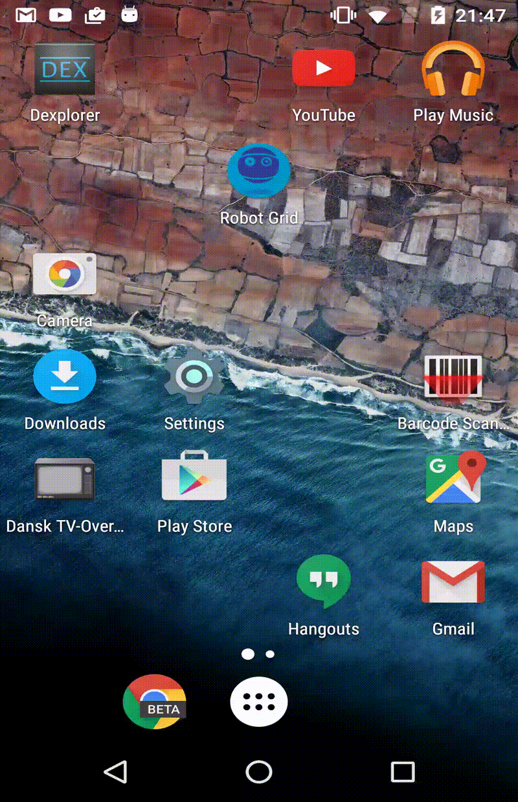

# Example of usage
Run the [APK file](app-debug-1_0.apk?raw=true)

Works in both landscape and portrait!

Landscape | Portrait
------------- | -------------
  | 

> **Note:** The UI look best on a phone screen - compared to a tablet.